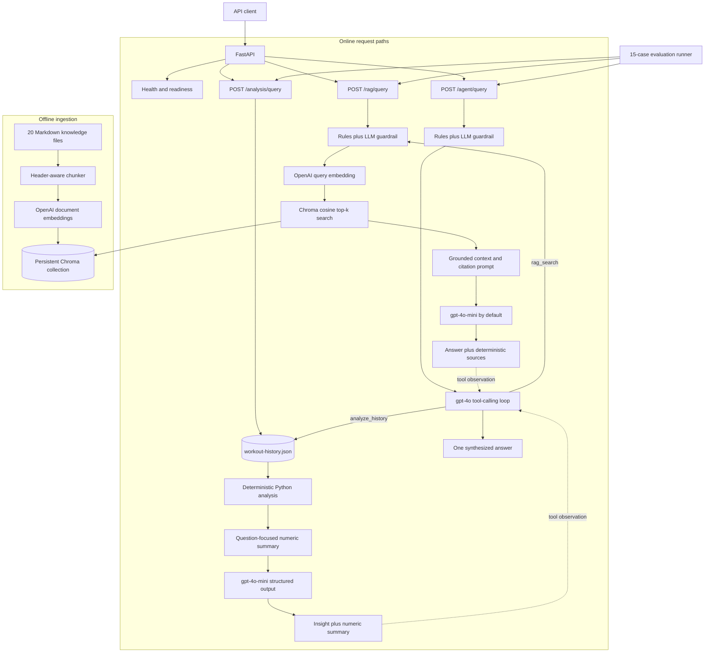

# AI Workout Coach

A FastAPI service that combines grounded fitness knowledge retrieval, deterministic workout-history
analysis, and a tool-calling coach assistant. LangChain provides the OpenAI chat and embedding
integrations, while Chroma stores the local fitness knowledge index.

The repository implements four features:

1. **Fitness Knowledge RAG** with source citations and safety/scope guardrails.
2. **Workout History Analysis** with unit normalization, trend metrics, deload detection, gap
   handling, bodyweight progression, and imbalance summaries.
3. **Coach Assist Agent** that can call either or both features and synthesize one answer.
4. **Evaluation Pipeline** with deterministic metrics and structured LLM judges.

## Architecture



### Runtime components

| Component | Responsibility |
| --- | --- |
| FastAPI `app` | Validation, routing, dependency construction, and OpenAPI documentation |
| RAG service | Guardrails, query embedding, retrieval, grounded generation, and source attribution |
| Analysis service | User isolation, deterministic calculations, compact summary creation, and insight generation |
| Agent service | Bounded OpenAI tool-calling loop over `rag_search` and `analyze_history` |
| Chroma | Cosine-similarity index persisted in the `chroma_data` Docker volume |
| OpenAI | `gpt-4o-mini` chat, `gpt-4o` agent/judge, and `text-embedding-3-small` embeddings by default |

The agent calls the RAG and analysis Python services directly. It does not make internal HTTP
requests. This keeps one validation and business-logic implementation for both direct API use and
agent tool use.

## Docker Quick Start

### Prerequisites

- Docker with the Compose plugin
- An OpenAI API key
- The included `data/knowledge_base` and `data/workout-history.json` files

### 1. Configure the environment

```bash
cp .env.example .env
```

Set `OPENAI_API_KEY` in `.env`. The checked-in defaults use `gpt-4o-mini` for RAG and analysis,
`gpt-4o` for the agent and evaluation judges, and `text-embedding-3-small` for embeddings.

### 2. Start the API and Chroma

```bash
docker compose up --build -d
```

Check the services:

```bash
docker compose ps
curl http://localhost:8000/health
curl http://localhost:8000/ready
```

### 3. Ingest the knowledge base

Ingestion is explicit so startup does not repeatedly embed unchanged documents:

```bash
docker compose exec app python -m app.rag.ingest
```

The current corpus produces 43 deterministic chunks from 20 Markdown files. Ingestion upserts all
current chunks and removes stale chunks previously owned by this pipeline.

### 4. Use the API

- Swagger UI: <http://localhost:8000/docs>
- ReDoc: <http://localhost:8000/redoc>
- API base URL: <http://localhost:8000>

Stop the stack with `docker compose down`. Use `docker compose down --volumes` only when you also
want to delete the Chroma index.

## Local Development

Python 3.12 or newer is required. The lock file is managed with `uv`.

```bash
cp .env.example .env
# Set OPENAI_API_KEY in .env.
uv sync --extra dev
docker compose up -d chroma
uv run python -m app.rag.ingest
uv run uvicorn app.api.main:app --reload
```

The `.env.example` local defaults already point to Chroma at `localhost:8001`. Run verification with:

```bash
uv run pytest
uv run ruff check .
```

To inspect chunking without OpenAI or Chroma calls:

```bash
uv run python -m app.rag.ingest --dry-run
```

## API Documentation

All request text is stripped of surrounding whitespace. Questions are limited to 2,000 characters;
user IDs are limited to 200 characters.

| Method | Path | Purpose |
| --- | --- | --- |
| `GET` | `/health` | Process liveness check |
| `GET` | `/ready` | Chroma dependency readiness check |
| `POST` | `/rag/query` | Grounded answer from the fitness knowledge base |
| `POST` | `/analysis/query` | Insight from one authoritative user's workout history |
| `POST` | `/agent/query` | Coach answer using model-selected tools |

### `GET /health`

Returns `200` whenever the FastAPI process is running.

```json
{"status": "ok"}
```

### `GET /ready`

Calls the Chroma heartbeat endpoint. It returns `200` with the same payload when Chroma is reachable,
or `503` with `{"detail":"Chroma is not ready"}` when it is unavailable.

### `POST /rag/query`

```bash
curl -X POST http://localhost:8000/rag/query \
  -H 'Content-Type: application/json' \
  -d '{"question":"How should I apply progressive overload to bench press?"}'
```

Example response:

```json
{
  "answer": "Add load after completing the target rep range with good form [08-progressive-overload.md::0000].",
  "sources": [
    {
      "source_file": "08-progressive-overload.md",
      "section_title": "Definition | Methods of Progressive Overload",
      "chunk_id": "08-progressive-overload.md::0000"
    }
  ]
}
```

Flow: guardrail check, query embedding, top-k Chroma search, grounded generation. Every source in
`sources` is constructed from retrieved metadata rather than model-generated attribution. If search
returns no chunks, the service skips generation and returns a fixed insufficient-context answer.
Blocked requests return a fixed response and an empty source list.

### `POST /analysis/query`

```bash
curl -X POST http://localhost:8000/analysis/query \
  -H 'Content-Type: application/json' \
  -d '{"user_id":"user_a","question":"What is my bench press trend?"}'
```

Example response shape:

```json
{
  "insight": "Your estimated bench strength increased across the recorded period...",
  "summary": {
    "intent": "trend",
    "canonical_weight_unit": "kg",
    "date_range": {"start": "2026-01-02", "end": "2026-03-19"},
    "training_day_count": 36,
    "mixed_units_normalized": false,
    "exercise_trends": {
      "Bench Press": {
        "session_count": 12,
        "likely_deload_dates": ["2026-01-27"],
        "strength": {"status": "progressing", "percent_change": 17.86}
      }
    },
    "user": {"user_id": "user_a", "name": "Alex", "profile": "..."}
  }
}
```

The server reads and validates the configured JSON file for every lookup, then selects history only
by the request's `user_id`. Clients cannot submit or override workout history. Raw sets are processed
locally and are not placed in the LLM prompt; only the derived summary is sent for wording.

Responses and errors:

- `200`: generated insight and deterministic summary
- `200`: fixed insufficient-data insight with an empty summary when the user has no workouts
- `404`: unknown `user_id`
- `503`: history file is unreadable or fails schema validation
- `422`: invalid request or extra client-supplied fields such as `history`

### `POST /agent/query`

```bash
curl -X POST http://localhost:8000/agent/query \
  -H 'Content-Type: application/json' \
  -d '{
    "user_id":"user_a",
    "question":"Based on my bench trend, how should I apply progressive overload?"
  }'
```

Example response:

```json
{
  "answer": "Based on your workout-history trend... General guidance recommends...",
  "tools_used": ["analyze_history", "rag_search"]
}
```

The model may call one or both tools, call them in either order, or recover after an unhelpful tool
result. Calls in the same model turn run concurrently. The loop is bounded by
`AGENT_MAX_ITERATIONS`; reaching the limit returns a fixed failure message instead of continuing to
spend tokens. A model-generated analysis `user_id` must exactly match the authoritative API request
`user_id` or the tool call is rejected.

## Feature Details

### Fitness RAG

- Markdown is split at `##` headings, then `###`, paragraphs, and finally token boundaries when
  necessary. Chunks target 300 tokens with a 450-token hard ceiling.
- Overlap is used only for forced token-level splits. Natural heading boundaries avoid duplicated
  retrieval results.
- Chunk IDs use `source-file::index`, making ingestion deterministic and stale-chunk cleanup safe.
- Metadata contains document and section titles, source/content hashes, token counts, and the
  embedding model.
- Chroma uses cosine distance and retrieves `RAG_TOP_K=5` chunks by default.
- Retrieved text is treated as untrusted data. The prompt forbids following instructions inside the
  knowledge base and requires inline chunk citations.

### Workout Analysis

The deterministic layer runs before generation and provides:

- `lb` to `kg` normalization before all aggregation and comparisons
- Epley estimated 1RM, date-aware linear slope, percent change, and progression classification
- likely deload detection using a drop-and-recovery heuristic, excluding detected deloads from the
  fitted strength trend
- bodyweight rep progression for valid zero-weight sets
- exercise and muscle-group sets, reps, session counts, and normalized weight volume
- rarely trained exercises, missing major muscle groups, unknown exercise names, and training gaps
- trend, neglect, balance, and plan-suggestion question routing

### Guardrails

RAG and agent requests use two layers:

1. High-confidence rules catch explicit diagnosis/treatment requests, dangerous weight-control
   behavior, and common unrelated requests.
2. An LLM structured classifier handles phrasing not matched by those rules.

Blocked categories are `medical`, `eating_disorder`, and `out_of_scope`. Responses are fixed and
supportive, do not diagnose or provide dangerous instructions, and direct the user to an appropriate
professional when needed. To avoid over-restriction, general technique, injury prevention,
sustainable calorie deficits, soreness, mobility, and ordinary recovery remain allowed. A symptom
word such as "pain" is not enough by itself; rules require diagnostic or treatment-seeking intent.

The agent has a pre-tool guardrail, and the RAG tool retains its own guardrail as defense in depth.

## Design Decisions and Tradeoffs

| Decision | Benefit | Tradeoff |
| --- | --- | --- |
| Deterministic analysis before generation | Repeatable numbers, smaller prompts, better user isolation | Exercise mapping and thresholds are curated heuristics, not a sports-science model |
| Send only compact summaries to the analysis LLM | Reduces raw-data exposure and unsupported arithmetic | Broad questions can still create larger summaries; wording remains nondeterministic |
| Header-aware chunks with deterministic IDs | Preserves document meaning and makes ingestion idempotent | Simple chunking cannot resolve every cross-section dependency |
| Cosine top-k retrieval without reranking | Small, understandable, locally hosted retrieval stack | Similarity-only search can miss exact terms or return redundant chunks |
| Metadata-owned source list | API citations remain tied to actual retrieved chunks | Inline prose citations are still generated and should be evaluated separately |
| Rules plus LLM guardrail | High-confidence cases are cheap; ambiguous language gets semantic classification | Most ordinary queries incur an extra model call and classification can still be imperfect |
| File-backed history read on every request | Data changes appear without an API restart | Repeated file I/O and a single JSON file do not scale to production workloads |
| Model-directed, bounded agent loop | Flexible tool order and easy addition of another registered tool | More latency, cost, and nondeterminism than a fixed workflow |
| Direct in-process tool calls | No internal HTTP overhead or duplicate API contracts | Agent and direct endpoints share process resources and failure domains |

The main production concerns are authentication/authorization, per-account quotas, prompt and tool
telemetry, cross-process caching, durable workout storage, and retrieval quality monitoring.

## Configuration

Configuration is loaded through `pydantic-settings`. See `.env.example` for every option.

| Variable | Default | Description |
| --- | --- | --- |
| `OPENAI_API_KEY` | empty | Required OpenAI API credential |
| `OPENAI_CHAT_MODEL` | `gpt-4o-mini` | RAG guardrail/answer and analysis insight model |
| `OPENAI_AGENT_MODEL` | `gpt-4o` | Coach-assist orchestration model |
| `OPENAI_JUDGE_MODEL` | `gpt-4o` | Evaluation judge model |
| `OPENAI_EMBEDDING_MODEL` | `text-embedding-3-small` | Document and query embedding model |
| `CHROMA_HOST` | `localhost` | Chroma host; Compose overrides this with `chroma` |
| `CHROMA_PORT` | `8001` | Local Chroma port; Compose uses container port `8000` |
| `CHROMA_COLLECTION` | `fitness_knowledge` | Vector collection name |
| `RAG_TOP_K` | `5` | Retrieved chunks per RAG query |
| `RAG_CHUNK_MIN_TOKENS` | `120` | Soft minimum used while balancing chunks |
| `RAG_CHUNK_TARGET_TOKENS` | `300` | Preferred chunk size |
| `RAG_CHUNK_MAX_TOKENS` | `450` | Hard chunk ceiling |
| `RAG_CHUNK_OVERLAP_TOKENS` | `40` | Overlap for forced token splits only |
| `RAG_EMBEDDING_BATCH_SIZE` | `64` | Embedding and Chroma upsert batch size |
| `AGENT_MAX_ITERATIONS` | `5` | Maximum agent model turns |
| `KNOWLEDGE_BASE_DIR` | `data/knowledge_base` | Markdown corpus directory |
| `WORKOUT_HISTORY_PATH` | `data/workout-history.json` | Authoritative workout dataset |

If the embedding model changes, use a new `CHROMA_COLLECTION` or recreate the existing collection.
The application rejects a collection whose recorded embedding model differs from the configured one.

## Cost Estimate

Prices and estimates below are in USD and use the repository defaults. Pricing was checked on
**June 14, 2026** against the official [OpenAI API pricing page](https://developers.openai.com/api/docs/pricing):

- `gpt-4o-mini`: $0.15 per 1M input tokens and $0.60 per 1M output tokens
- `text-embedding-3-small`: $0.02 per 1M input tokens

No cached-input discount is assumed. Estimates exclude retries, network/infrastructure cost, the
Feature 3 agent, and Feature 4 evaluation. Output is budgeted at 180 tokens per user-facing answer.

| Feature | Representative calls and tokens | Cost/query | 1,000 queries/day | 30-day month |
| --- | --- | ---: | ---: | ---: |
| Feature 1: RAG | Guardrail: 287 input + 10 output; query embedding: 11 input; answer: 1,423 input + 180 output | **$0.00037** | **$0.37/day** | **$11.12** |
| Feature 2: Analysis | Structured analysis: 611 input + 180 output | **$0.00020** | **$0.20/day** | **$5.99** |

Feature 1 formula:

```text
((287 + 1,423) * $0.15 / 1,000,000)
+ ((10 + 180) * $0.60 / 1,000,000)
+ (11 * $0.02 / 1,000,000)
= $0.00037072 per query
```

Feature 2 formula:

```text
(611 * $0.15 / 1,000,000)
+ (180 * $0.60 / 1,000,000)
= $0.00019965 per query
```

The current 43-chunk corpus contains about 8,902 embedding tokens, so one full ingestion run costs
about **$0.00018** at the listed embedding price. Real costs vary with question length, retrieved
chunk sizes, answer length, broad versus exercise-specific analysis, retries, and future pricing.

### What to optimize first

First, record actual tokens, model calls, latency, cache hits, endpoint, and account ID for every
request. With that baseline, add a versioned cache for repeated RAG answers and analysis insights,
keyed by normalized request plus model/prompt and knowledge/history version. A cache hit removes the
dominant generation cost. If hit rate is low, optimize RAG context next with dynamic top-k or a cheap
reranker, then skip the LLM guardrail classifier for high-confidence deterministic allow/block cases.
The query embedding itself is already negligible.

## Usage Metering Architecture

Meter model name, input/output tokens, embedding tokens, call count, latency, endpoint, tool name,
and estimated cost, tagged by coach/account ID and request ID. Enforce limits in API middleware or a
shared dependency before constructing an LLM call; agent tool handlers must use the same meter so
internal calls cannot bypass quotas. Store append-only usage events and maintain atomic daily/monthly
counters in Redis or a database. Run a preflight quota check before each model or embedding call and
reserve estimated usage for multi-call agent requests, then reconcile with provider-reported tokens.
If a coach reaches the limit mid-session, stop before the next paid call and return a clear limit
response. Deterministic analysis can still be returned without generated prose where appropriate;
otherwise offer retry-after, queued processing, or an upgrade path rather than silently degrading or
overspending.

## Evaluation

The live suite contains 15 cases: 5 RAG, 5 analysis, 3 multi-tool agent, and 2 adversarial guardrail
cases. It combines source attribution, expected-source, data-grounding, expected-value, guardrail,
and tool-selection checks with structured faithfulness and criteria judges.

```bash
docker compose up -d chroma
uv run python -m app.rag.ingest
uv run python -m app.eval.run_eval
```

The runner reads `evaluation-test-set.json` and writes `evaluation-results.json`. The documented live
baseline from June 14, 2026 is 12/15 cases passed (80%). See [EVALUATION.md](EVALUATION.md) for metric
definitions, per-case results, and failure analysis.

## Repository Layout

```text
app/
  agent/       Tool schemas, handlers, prompts, and orchestration loop
  analysis/    Validation, normalization, aggregation, trends, and insights
  api/         FastAPI application and route modules
  core/        Settings plus shared OpenAI and Chroma factories
  eval/        Test-set models, metrics, judges, and evaluation runner
  rag/         Chunking, ingestion, vector store, retrieval, prompts, and guardrails
data/
  knowledge_base/       Fitness Markdown corpus
  workout-history.json Authoritative sample workout data
tests/                  Unit and API tests
```

Related design and evaluation documents:

- [PLAN.md](PLAN.md)
- [EVALUATION.md](EVALUATION.md)
- [AI_WORKFLOW.md](AI_WORKFLOW.md)
