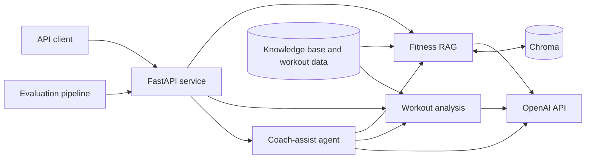

# AI Workout Coach

An AI-assisted fitness service built around a grounded knowledge RAG pipeline,
workout-history analysis, and a tool-calling coach agent. The API uses FastAPI,
LangChain's OpenAI integrations, and a persistent Chroma vector database.

> Status: initial infrastructure plus Fitness RAG ingestion and retrieval.
> Guardrails, workout analysis, agent orchestration, and evaluation are still to come.

## Architecture

<!-- TODO: Replace/refine this placeholder as feature data flows are implemented. -->



The Compose stack contains:

- `app`: FastAPI on <http://localhost:8000>
- `chroma`: Chroma on <http://localhost:8001>, persisted in a named volume

Inside the Docker network, the app reaches Chroma at `http://chroma:8000`.
`langchain-openai` provides the shared chat and embedding interfaces, while
`langchain-chroma` provides ingestion and retrieval over the remote Chroma service.
The Chroma integration requires the full `chromadb` Python package even
though the application only connects to the separate server over HTTP.

## Quick Start

Requirements: Docker with the Compose plugin and an OpenAI API key for the
planned AI-backed endpoints.

```bash
cp .env.example .env
# Set OPENAI_API_KEY in .env when implementing or using AI-backed features.
docker compose up --build
```

Then open:

- Swagger UI: <http://localhost:8000/docs>
- ReDoc: <http://localhost:8000/redoc>
- Liveness: <http://localhost:8000/health>
- Dependency readiness: <http://localhost:8000/ready>

Stop the stack with `docker compose down`. Add `--volumes` only when you also
intend to delete the persisted Chroma data.

## Local Development

Python 3.12 or newer is required.

```bash
python -m venv .venv
source .venv/bin/activate
pip install -e '.[dev]'
cp .env.example .env
uvicorn app.api.main:app --reload
```

For local execution outside Docker, set `CHROMA_HOST=localhost` and
`CHROMA_PORT=8001` in `.env` while the Compose Chroma service is running.

## API Skeleton

| Method | Path | Purpose | Current state |
| --- | --- | --- | --- |
| `GET` | `/health` | Process liveness | Implemented |
| `GET` | `/ready` | Chroma connectivity | Implemented |
| `POST` | `/rag/query` | Grounded fitness knowledge query | Implemented |
| `POST` | `/analysis/query` | Workout-history insight | Contract only (`501`) |
| `POST` | `/agent/query` | Tool-calling coach assistant | Contract only (`501`) |

Request and response schemas are visible in Swagger UI. Feature behavior and
guardrails will follow the contracts in [PLAN.md](PLAN.md).

### Fitness RAG Retrieval

`POST /rag/query` accepts a non-empty `question` and performs LangChain Chroma
similarity search using the configured `RAG_TOP_K`. Retrieved chunks are formatted
as untrusted context and passed through a LangChain prompt/model/output-parser
chain. The prompt restricts the answer to that context and requires inline chunk
citations such as `[01-bench-press.md::0001]`.

The response `sources` list is built directly from retrieved document metadata,
not generated by the model. Each source includes `source_file`, `section_title`,
and `chunk_id`. When retrieval returns no chunks, the endpoint returns a fixed
insufficient-context answer without calling the chat model. Topic and medical
guardrails are intentionally deferred to the next Feature 1 stage.

## Configuration

Configuration is read from environment variables through `pydantic-settings`.
Copy `.env.example` to `.env`; never commit real credentials.

| Variable | Default | Description |
| --- | --- | --- |
| `OPENAI_API_KEY` | empty | OpenAI credential; required by AI-backed features |
| `OPENAI_CHAT_MODEL` | `gpt-4o-mini` | RAG and analysis generation model |
| `OPENAI_AGENT_MODEL` | `gpt-4o` | Agent orchestration model |
| `OPENAI_JUDGE_MODEL` | `gpt-4o` | Evaluation judge model |
| `OPENAI_EMBEDDING_MODEL` | `text-embedding-3-small` | Knowledge/query embedding model |
| `CHROMA_EXPOSED_PORT` | `8001` | Chroma port exposed on the host |
| `CHROMA_COLLECTION` | `fitness_knowledge` | Fitness document collection |
| `RAG_TOP_K` | `5` | Number of chunks retrieved per query |
| `RAG_CHUNK_MIN_TOKENS` | `120` | Soft lower bound used when balancing chunks |
| `RAG_CHUNK_TARGET_TOKENS` | `300` | Preferred chunk size |
| `RAG_CHUNK_MAX_TOKENS` | `450` | Hard chunk size ceiling |
| `RAG_CHUNK_OVERLAP_TOKENS` | `40` | Overlap for forced token-level splits only |
| `RAG_EMBEDDING_BATCH_SIZE` | `64` | OpenAI embedding and Chroma upsert batch size |
| `AGENT_MAX_ITERATIONS` | `5` | Tool-loop safety limit |

See [.env.example](.env.example) for the complete starter configuration.

## Planned Structure

```text
app/
  api/          FastAPI application and route modules
  core/         Settings and shared LangChain model providers
  rag/          Chunking, ingestion, retrieval, and safety guardrails
  analysis/     Deterministic workout processing and LLM insights
  agent/        Tool definitions and orchestration loop
  eval/         Test cases, metrics, and evaluation runner
data/
  knowledge_base/
  workout-history.json
```

## Design Notes

- Deterministic workout calculations happen before an LLM receives a compact
  numeric summary; raw history is not sent to the model.
- RAG answers are constrained to retrieved context, use inline chunk citations,
  and include deterministic source metadata.
- OpenAI chat and embedding calls use shared LangChain factories so retrieval,
  analysis, and agent implementations do not instantiate provider clients ad hoc.
- Medical diagnosis and eating-disorder-risk requests will be intercepted before
  generation with a supportive, non-diagnostic refusal.
- Agent tool arguments will be validated and tool calls bounded by
  `AGENT_MAX_ITERATIONS`.

## Documentation Roadmap

- Expand this README with final API examples, tradeoffs, cost estimates, and the
  production usage-metering design.
- Add `AI_WORKFLOW.md` for prompting decisions and development reflections.
- Add `EVALUATION.md` for the test set, metric results, failures, and follow-ups.
